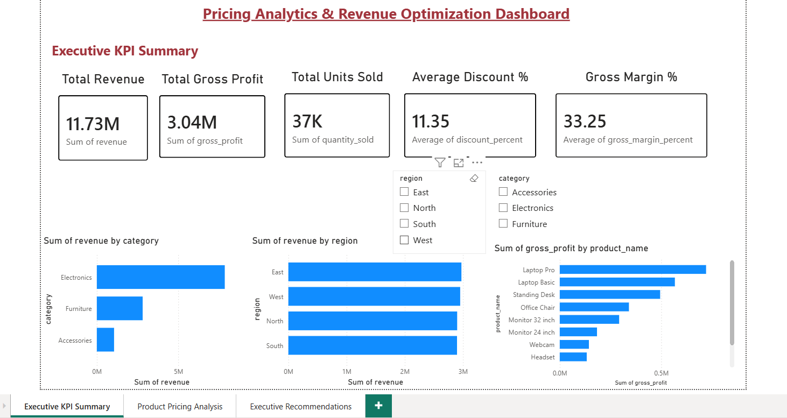
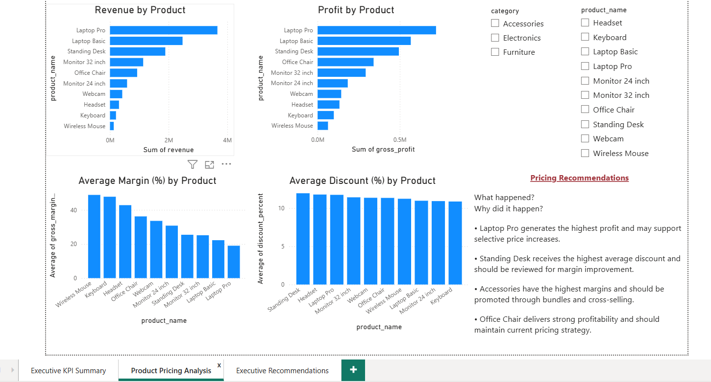
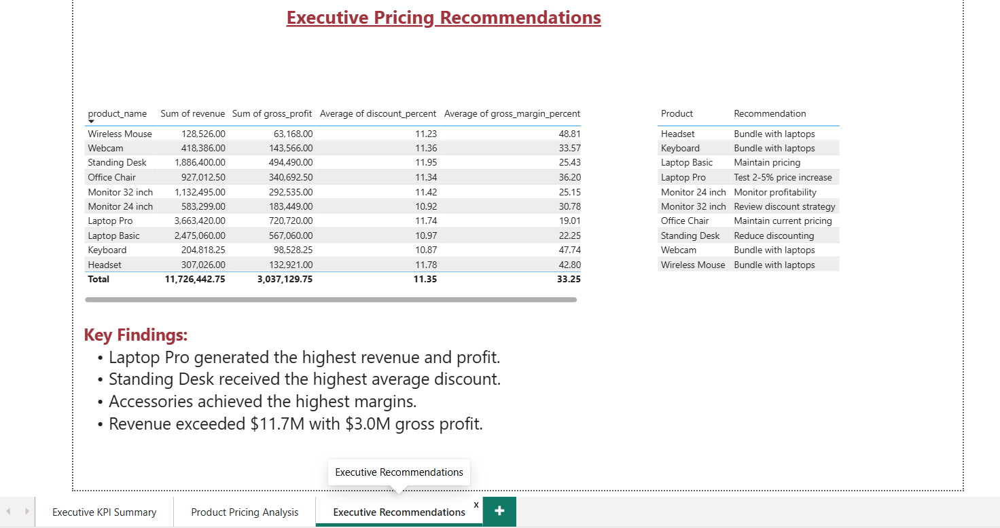

# Pricing Analytics & Revenue Optimization Platform

## Project Overview

This project is an end-to-end Pricing Analytics solution built using Python, PostgreSQL, SQL, Power BI, and DAX.

The objective is to analyze product pricing, discounts, profitability, and revenue performance to identify pricing optimization opportunities and support business decision-making.

---

## Business Problem

Organizations often struggle to understand:

* Which products generate the highest revenue and profit
* How discounts impact profitability
* Which products are candidates for price increases
* Which products require pricing strategy adjustments

This project addresses these challenges through data analysis, SQL reporting, and interactive Power BI dashboards.

---

## Tech Stack

### Programming & Analytics

* Python
* Pandas
* NumPy

### Database

* PostgreSQL
* SQLAlchemy

### Business Intelligence

* Power BI
* DAX

### Version Control

* Git
* GitHub

---

## Project Architecture

Raw Sales Data
↓
Python Data Cleaning
↓
PostgreSQL Database
↓
SQL KPI Analysis
↓
Power BI Dashboard
↓
Pricing Recommendations

---

## Key Features

### Data Engineering

* Generated 5,000+ realistic sales transactions
* Cleaned and transformed raw data using Python
* Loaded processed data into PostgreSQL

### Analytics

* Revenue Analysis
* Profitability Analysis
* Discount Analysis
* Margin Analysis
* Product Performance Evaluation

### Dashboard Reporting

#### Executive KPI Summary

* Total Revenue
* Gross Profit
* Gross Margin %
* Average Discount %
* Units Sold

#### Product Pricing Analysis

* Revenue by Product
* Profit by Product
* Discount Analysis
* Margin Analysis

#### Executive Recommendations

* Pricing optimization opportunities
* Discount reduction opportunities
* Product promotion recommendations
* Rule-based DAX classifications

---

## Key Results

| KPI              |   Value |
| ---------------- | ------: |
| Revenue          | $11.73M |
| Gross Profit     |  $3.04M |
| Gross Margin     |  25.90% |
| Units Sold       |  37,450 |
| Average Discount |  11.35% |

---

## Dashboard Screenshots

### Executive KPI Summary

### Product Pricing Analysis

### Executive Recommendations

---

## Skills Demonstrated

* Python Data Analysis
* SQL Querying
* PostgreSQL
* Power BI Dashboard Development
* DAX Calculated Columns
* Business KPI Reporting
* Pricing Analytics
* Financial Analysis
* Executive Reporting

---

## Future Enhancements

* Automated data refresh
* Forecasting models
* Price elasticity analysis
* Customer segmentation
* Revenue forecasting
